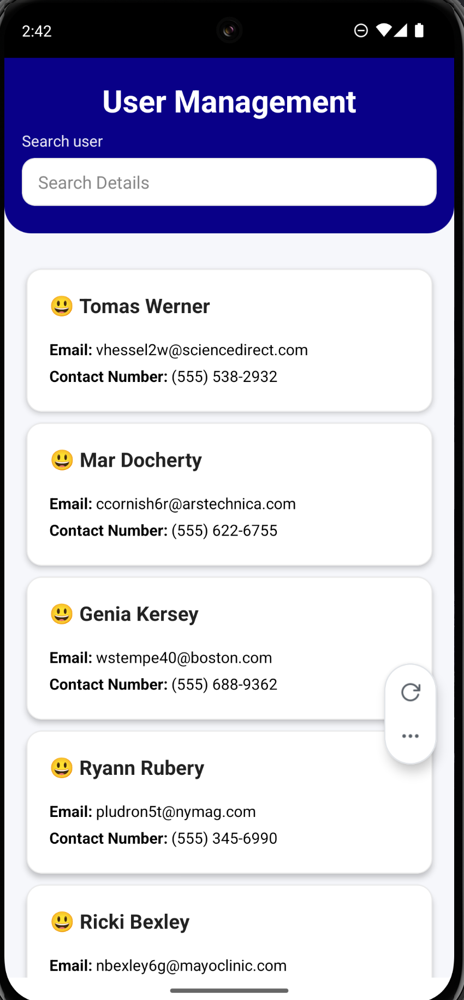
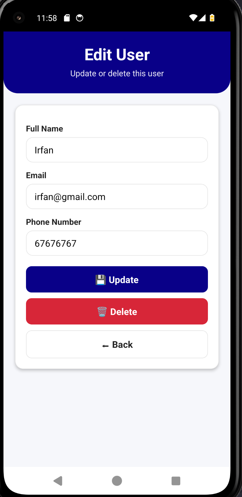
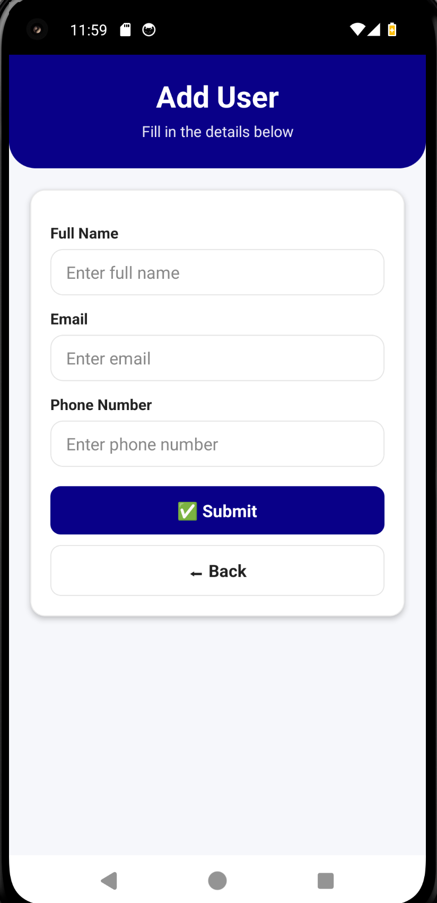

# 📱 **App Name**

This is a simple user management app where users of the app can search user details through their mobile number, email, or name.

---

## 🧐 **What is this app about?**

This mobile application is developed as part of a team project.  
It connects to a backend **[web service (API)](https://onlineuserappwebservice.onrender.com/users)** to retrieve and store data, ensuring that information persists across sessions and devices.

---

## 🔥 **Notable features of the app**

- User-friendly mobile interface
- Integration with a backend web service
- Data stored and retrieved via RESTful API calls
- Error handling and input validation

---

## 🔌 **Backend Web Service**

This app communicates with a backend web service using HTTP requests.  
The table below documents the available API routes used by the mobile application.

### 📡 **API Routes Documentation**

| Route             | HTTP Method | Description              | Request Body / Parameters                                                         |
| ----------------- | ----------- | ------------------------ | --------------------------------------------------------------------------------- |
| `/users`          | GET         | Retrieves all users      | None                                                                              |
| `/users`          | POST        | Adds a new user          | JSON Body: `{ "fullName": "string", "email": "string", "phoneNumber": "string" }` |
| `/users/{userId}` | PUT         | Updates an existing user | JSON Body: `{ "fullName": "string", "email": "string", "phoneNumber": "string" }` |
| `/users/{userId}` | DELETE      | Deletes a user           | None (uses `userId` as path parameter)                                            |

---

## 📸 **Screenshots of the mobile app**

The screenshots below showcase the key screens of the mobile application.

  
  
  

_Home Screen_

---

## 👥 **Team Contributions**

As this is a team project, each member’s role and contributions are documented below.

| Name   | Role               | Responsibilities                      |
| ------ | ------------------ | ------------------------------------- |
| Alyssa | Frontend Developer | UI design, layout, screen navigation  |
| Rio    | Backend Developer  | API routes, database integration      |
| Irfan  | Project Manager    | Planning, coordination, documentation |
